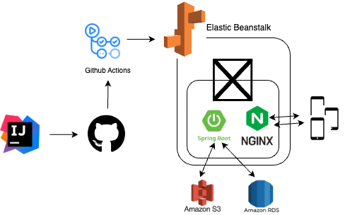

# '칵테일이닭' 서버 저장소

> 기존의 `Firebase` + `Firestore`로 구성된 프로젝트 `칵테일이닭`의 서버 이전 프로젝트

## 구조도

- [사용 라이브러리](https://github.com/dlgocks1/cocktaildakk_server/blob/develop/buildSrc/src/main/java/Dependency.kt)

### What I Learn?

1. `Github Action` + `Elastic Beanstalk`로 배포 자동화 해보기
    - +) 해야할 것 : `Docker` + `Docker Hub`로 말아 올리기
2. `Spring`에서의 다중 모듈 관리
3. `AOP`를 활용해 전역 에러 관리하기
4. `JWT`구현 방식에 관하여
    - +) `Elastic Cache`는 비싸다.
5. `RDB`사용해 보기
    - 쿼리문
    - 테이블 수정
    - 정규화
6. `WAS` 그리고 `Nginx`와  `Netty`
7. `Spring`의 `Ioc`

## 관련 링크

#### [Cocktaildakk-Android-Repository](https://github.com/dlgocks1/Cocktaildakk-Compose)

#### [Donwload In GooglePlay](https://play.google.com/store/apps/details?id=com.compose.cocktaildakk_compose)

